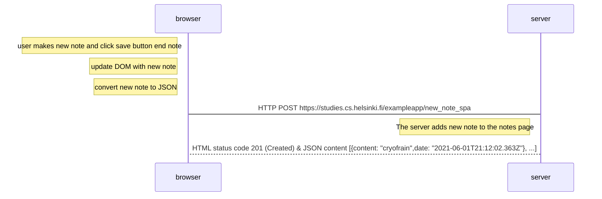

```mermaid
sequenceDiagram
  participant browser
  participant server

note left of browser: user makes new note and click save button end note

note left of browser: update DOM with new note

note left of browser: convert new note to JSON

browser->server: HTTP POST https://studies.cs.helsinki.fi/exampleapp/new_note_spa

note left of server: The server adds new note to the notes page

server-->browser: HTML status code 201 (Created) & JSON content [{content: "cryofrain",date: "2021-06-01T21:12:02.363Z"}, ...]
```
